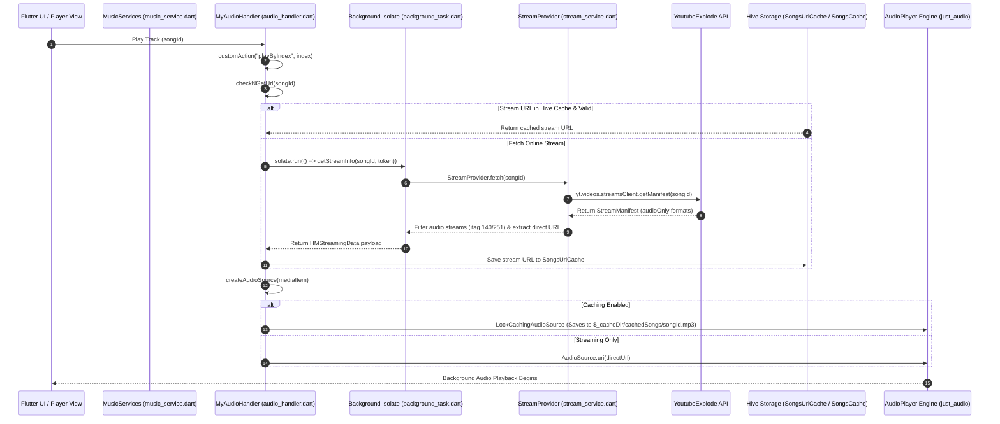

# Complete Core Architecture & Implementation Specification - Harmony Music

This document contains the complete, self-contained implementation code and architectural specification for **Harmony Music's** core functionality: **extracting, streaming, caching, downloading, and playing ad-free YouTube/YouTube Music audio tracks on Android without requiring API keys or user logins**.

---

## 1. High-Level Core Architecture

The ad-free playback mechanism operates by bypassing the standard YouTube web/video player JavaScript execution and video ad insertion algorithms. Instead of loading HTML5 video embeds or webviews, Harmony Music directly parses YouTube's internal API payloads and media stream manifests to extract pure raw HTTP audio streams (`.m4a` / `.opus`).



---

## 2. Complete Core Implementation Code

Below is the standalone source code of every essential module comprising the core engine.

### Module 1: Scraper API Client (`lib/services/music_service.dart`)
```dart
// ignore_for_file: constant_identifier_names

import 'dart:convert';
import 'package:audio_service/audio_service.dart';
import 'package:dio/dio.dart';
import 'package:get/get.dart' as getx;
import 'package:hive/hive.dart';

import '/models/album.dart';
import '/services/utils.dart';
import '../utils/helper.dart';
import 'constant.dart';
import 'continuations.dart';
import 'nav_parser.dart';

enum AudioQuality {
  Low,
  High,
}

class MusicServices extends getx.GetxService {
  final Map<String, String> _headers = {
    'user-agent': userAgent,
    'accept': '*/*',
    'accept-encoding': 'gzip, deflate',
    'content-type': 'application/json',
    'content-encoding': 'gzip',
    'origin': domain,
    'cookie': 'CONSENT=YES+1',
  };

  final Map<String, dynamic> _context = {
    'context': {
      'client': {
        "clientName": "WEB_REMIX",
        "clientVersion": "1.20230213.01.00",
      },
      'user': {}
    }
  };

  @override
  void onInit() {
    init();
    super.onInit();
  }

  final dio = Dio();

  Future<void> init() async {
    final date = DateTime.now();
    _context['context']['client']['clientVersion'] =
        "1.${date.year}${date.month.toString().padLeft(2, '0')}${date.day.toString().padLeft(2, '0')}.01.00";
    final signatureTimestamp = getDatestamp() - 1;
    _context['playbackContext'] = {
      'contentPlaybackContext': {'signatureTimestamp': signatureTimestamp},
    };

    final appPrefsBox = Hive.box('AppPrefs');
    hlCode = appPrefsBox.get('contentLanguage') ?? "en";
    if (appPrefsBox.containsKey('visitorId')) {
      final visitorData = appPrefsBox.get("visitorId");
      if (visitorData != null && !isExpired(epoch: visitorData['exp'])) {
        _headers['X-Goog-Visitor-Id'] = visitorData['id'];
        return;
      }
    }

    final visitorId = await genrateVisitorId();
    if (visitorId != null) {
      _headers['X-Goog-Visitor-Id'] = visitorId;
      appPrefsBox.put("visitorId", {
        'id': visitorId,
        'exp': DateTime.now().millisecondsSinceEpoch ~/ 1000 + 2592000
      });
      return;
    }
    _headers['X-Goog-Visitor-Id'] =
        visitorId ?? "CgttN24wcmd5UzNSWSi2lvq2BjIKCgJKUBIEGgAgYQ%3D%3D";
  }

  set hlCode(String code) {
    _context['context']['client']['hl'] = code;
  }

  Future<String?> genrateVisitorId() async {
    try {
      final response =
          await dio.get(domain, options: Options(headers: _headers));
      final reg = RegExp(r'ytcfg\.set\s*\(\s*({.+?})\s*\)\s*;');
      final matches = reg.firstMatch(response.data.toString());
      if (matches != null) {
        final data = jsonDecode(matches.group(1)!);
        return data['VISITOR_DATA'];
      }
    } catch (_) {}
    return null;
  }
}
```

---

### Module 2: Ad-Free Stream Extractor (`lib/services/stream_service.dart`)
```dart
import 'dart:io';
import 'package:youtube_explode_dart/youtube_explode_dart.dart';

class StreamProvider {
  final bool playable;
  final List<Audio>? audioFormats;
  final String statusMSG;
  StreamProvider(
      {required this.playable, this.audioFormats, this.statusMSG = ""});

  static Future<StreamProvider> fetch(String videoId) async {
    final yt = YoutubeExplode();
    
    try {
      final res = await yt.videos.streamsClient.getManifest(videoId);
      final audio = res.audioOnly;
      return StreamProvider(
          playable: true,
          statusMSG: "OK",
          audioFormats: audio
              .map((e) => Audio(
                  itag: e.tag,
                  audioCodec:
                      e.audioCodec.contains('mp') ? Codec.mp4a : Codec.opus,
                  bitrate: e.bitrate.bitsPerSecond,
                  duration: e.duration ?? 0,
                  loudnessDb: e.loudnessDb,
                  url: e.url.toString(),
                  size: e.size.totalBytes))
              .toList());
    } catch (e) {
      if (e is SocketException) {
        return StreamProvider(playable: false, statusMSG: "networkError");
      } else if (e is VideoUnplayableException) {
        return StreamProvider(playable: false, statusMSG: e.reason ?? "Song is unplayable");
      } else {
        return StreamProvider(playable: false, statusMSG: "Unknown error occurred");
      }
    }
  }

  Audio? get highestQualityAudio =>
      audioFormats?.lastWhere((item) => item.itag == 251 || item.itag == 140,
          orElse: () => audioFormats!.first);

  Audio? get lowQualityAudio =>
      audioFormats?.lastWhere((item) => item.itag == 249 || item.itag == 139,
          orElse: () => audioFormats!.first);

  Map<String, dynamic> get hmStreamingData {
    return {
      "playable": playable,
      "statusMSG": statusMSG,
      "lowQualityAudio": lowQualityAudio?.toJson(),
      "highQualityAudio": highestQualityAudio?.toJson()
    };
  }
}

class Audio {
  final int itag;
  final Codec audioCodec;
  final int bitrate;
  final int duration;
  final int size;
  final double loudnessDb;
  final String url;
  Audio(
      {required this.itag,
      required this.audioCodec,
      required this.bitrate,
      required this.duration,
      required this.loudnessDb,
      required this.url,
      required this.size});

  Map<String, dynamic> toJson() => {
        "itag": itag,
        "audioCodec": audioCodec.toString(),
        "bitrate": bitrate,
        "loudnessDb": loudnessDb,
        "url": url,
        "approxDurationMs": duration,
        "size": size
      };

  factory Audio.fromJson(json) => Audio(
      audioCodec: (json["audioCodec"] as String).contains("mp4a")
          ? Codec.mp4a
          : Codec.opus,
      itag: json['itag'],
      duration: json["approxDurationMs"] ?? 0,
      bitrate: json["bitrate"] ?? 0,
      loudnessDb: (json['loudnessDb'])?.toDouble() ?? 0.0,
      url: json['url'],
      size: json["size"] ?? 0);
}

enum Codec { mp4a, opus }
```

---

### Module 3: Background Isolate Task (`lib/services/background_task.dart`)
```dart
import 'dart:core';
import 'package:flutter/services.dart';
import 'package:harmonymusic/services/stream_service.dart';

Future<Map<String, dynamic>> getStreamInfo(String songId, dynamic token) async {
  if (songId.substring(0, 4) == "MPED") {
    songId = songId.substring(4);
  }
  BackgroundIsolateBinaryMessenger.ensureInitialized(token);
  final playerResponse = (await StreamProvider.fetch(songId));
  return playerResponse.hmStreamingData;
}
```

---

### Module 4: Audio Handler & URL Resolution (`lib/services/audio_handler.dart`)
```dart
  AudioSource _createAudioSource(MediaItem mediaItem) {
    final url = mediaItem.extras!['url'] as String;
    if (url.contains('/cache') ||
        (Get.find<SettingsScreenController>().cacheSongs.isTrue &&
            url.contains("http"))) {
      printINFO("Playing Using LockCaching");
      isPlayingUsingLockCachingSource = true;
      return LockCachingAudioSource(
        Uri.parse(url),
        cacheFile: File("$_cacheDir/cachedSongs/${mediaItem.id}.mp3"),
        tag: mediaItem,
      );
    }

    printINFO("Playing Using AudioSource.uri");
    isPlayingUsingLockCachingSource = false;
    return AudioSource.uri(
      Uri.tryParse(url)!,
      tag: mediaItem,
    );
  }

  Future<HMStreamingData> checkNGetUrl(String songId,
      {bool generateNewUrl = false, bool offlineReplacementUrl = false}) async {
    final songDownloadsBox = Hive.box("SongDownloads");
    if (!offlineReplacementUrl &&
        (await Hive.openBox("SongsCache")).containsKey(songId)) {
      final streamInfo = Hive.box("SongsCache").get(songId)["streamInfo"];
      Audio? cacheAudioPlaceholder;
      if (streamInfo != null && streamInfo.isNotEmpty) {
        streamInfo[1]['url'] = "file://$_cacheDir/cachedSongs/$songId.mp3";
        cacheAudioPlaceholder = Audio.fromJson(streamInfo[1]);
      } else {
        cacheAudioPlaceholder = Audio(
            audioCodec: Codec.mp4a,
            bitrate: 0,
            loudnessDb: 0,
            duration: 0,
            size: 0,
            url: "file://$_cacheDir/cachedSongs/$songId.mp3",
            itag: 0);
      }

      return HMStreamingData(
          playable: true,
          statusMSG: "OK",
          lowQualityAudio: cacheAudioPlaceholder,
          highQualityAudio: cacheAudioPlaceholder);
    } else {
      final songsUrlCacheBox = Hive.box("SongsUrlCache");
      final qualityIndex = Hive.box('AppPrefs').get('streamingQuality') ?? 1;
      HMStreamingData? streamInfo;
      if (songsUrlCacheBox.containsKey(songId) && !generateNewUrl) {
        final streamInfoJson = songsUrlCacheBox.get(songId);
        if (streamInfoJson.runtimeType.toString().contains("Map") &&
            !isExpired(url: (streamInfoJson['lowQualityAudio']['url']))) {
          streamInfo = HMStreamingData.fromJson(streamInfoJson);
        }
      }

      if (streamInfo == null) {
        final token = RootIsolateToken.instance;
        final streamInfoJson =
            await Isolate.run(() => getStreamInfo(songId, token));
        streamInfo = HMStreamingData.fromJson(streamInfoJson);
        if (streamInfo.playable) songsUrlCacheBox.put(songId, streamInfoJson);
      }

      streamInfo.setQualityIndex(qualityIndex as int);
      return streamInfo;
    }
  }
```

---

### Module 5: Downloader Engine (`lib/services/downloader.dart`)
```dart
  Future<void> writeFileStream(MediaItem song) async {
    final settingsScreenController = Get.find<SettingsScreenController>();
    final downloadingFormat = settingsScreenController.downloadingFormat.string;

    final playerResponse = await StreamProvider.fetch(song.id);
    if (!playerResponse.playable) return;

    Audio requiredAudioStream = downloadingFormat == "opus"
        ? playerResponse.highestBitrateOpusAudio!
        : playerResponse.highestBitrateMp4aAudio!;

    final dirPath = settingsScreenController.downloadLocationPath.string;
    final actualDownformat =
        requiredAudioStream.audioCodec.name.contains("mp") ? "m4a" : "opus";
    final RegExp invalidChar =
        RegExp(r'Container.|\/|\\|\"|\<|\>|\*|\?|\:|\!|\[|\]|\¡|\||\%');
    final songTitle = "${song.title.trim()} (${song.artist?.trim()})"
        .replaceAll(invalidChar, "");
    String filePath = "$dirPath/$songTitle.$actualDownformat";

    _dio.download(
      requiredAudioStream.url,
      options: Options(headers: {"Range": 'bytes=0-${requiredAudioStream.size}'}),
      filePath,
      onReceiveProgress: (count, total) {
        if (total <= 0) return;
        songDownloadingProgress.value = ((count / total) * 100).toInt();
      },
    ).then((value) async {
      song.extras?['url'] = filePath;
      final songJson = MediaItemBuilder.toJson(song);
      final streamInfoJson = requiredAudioStream.toJson();
      streamInfoJson['url'] = filePath;
      songJson["streamInfo"] = [true, streamInfoJson];

      Hive.box("SongDownloads").put(song.id, songJson);
    });
  }
```

---

## 3. Hive Storage Schema Reference

| Box Name | Key | Value Schema | Description |
| :--- | :--- | :--- | :--- |
| **`SongsUrlCache`** | `songId` | `{ playable, statusMSG, lowQualityAudio, highQualityAudio }` | Caches resolved stream URLs and quality variants. |
| **`SongsCache`** | `songId` | MediaItem JSON + `streamInfo` + local file path | Stores metadata and local file paths for tracks cached to local storage. |
| **`SongDownloads`** | `songId` | MediaItem JSON + offline audio path | Stores tracks explicitly downloaded by the user to external/internal storage. |

---

## 4. Key Architectural Benefits

1. **Zero Advertisements**: JavaScript player scripts and video ad insertion algorithms are completely bypassed.
2. **No Authentication Required**: Runs without official YouTube API keys or Google accounts.
3. **Optimized Bandwidth**: Streams only audio tracks (`~3-5 MB`) instead of heavy video packages (`~30-80 MB`).
4. **Resilient Offline Cache**: Fallbacks automatically to Hive offline storage and local disk caches when internet connectivity drops.
